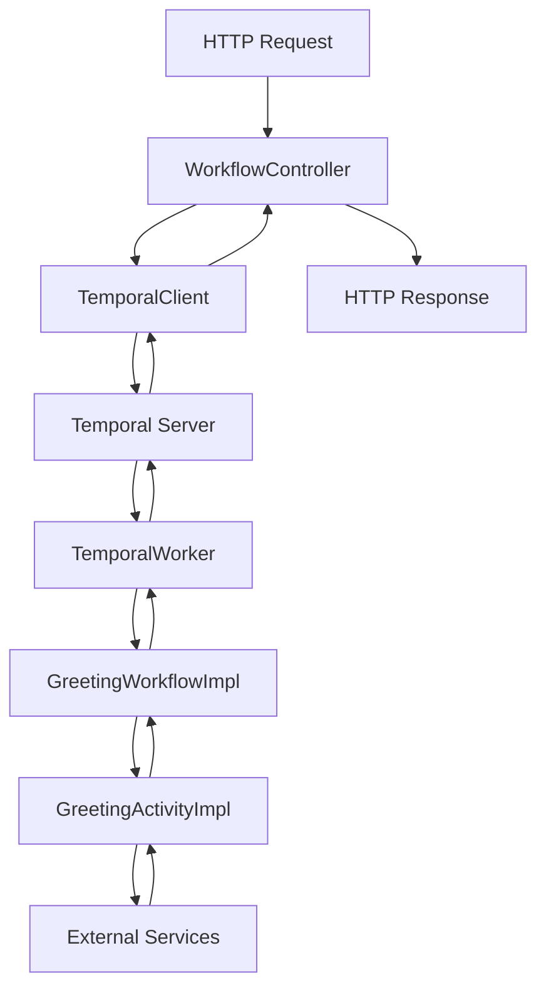

# 📁 Cấu trúc Project - Temporal Learning

## 🏗️ Tổng quan cấu trúc

```
temporal-learning/
├── 📄 README.md                           # Tài liệu chi tiết đầy đủ
├── 📄 QUICK_START.md                      # Hướng dẫn nhanh
├── 📄 PROJECT_STRUCTURE.md                # File này
├── 📄 pom.xml                             # Maven configuration
├── 📄 .gitignore                          # Git ignore rules
├── 🚀 start-temporal.sh                   # Script khởi động
├── 🛑 stop-temporal.sh                    # Script dừng
│
├── 📂 src/main/java/com/example/temporal/
│   ├── 📄 TemporalLearningApplication.java # Main Spring Boot class
│   │
│   ├── 📂 config/
│   │   └── 📄 TemporalConfig.java          # Cấu hình Temporal Client
│   │
│   ├── 📂 activity/                        # Activities (side effects)
│   │   ├── 📄 GreetingActivity.java        # Activity interface
│   │   └── 📄 GreetingActivityImpl.java    # Activity implementation
│   │
│   ├── 📂 workflow/                        # Workflows (business logic)
│   │   ├── 📄 GreetingWorkflow.java        # Workflow interface
│   │   └── 📄 GreetingWorkflowImpl.java    # Workflow implementation
│   │
│   ├── 📂 worker/                          # Workers (executors)
│   │   └── 📄 TemporalWorker.java          # Worker configuration
│   │
│   ├── 📂 client/                          # Clients (workflow starters)
│   │   └── 📄 TemporalClient.java          # Client service
│   │
│   └── 📂 controller/                      # REST APIs
│       └── 📄 WorkflowController.java      # REST endpoints
│
├── 📂 src/main/resources/
│   └── 📄 application.yml                  # Spring Boot configuration
│
└── 📂 src/test/java/com/example/temporal/
    ├── 📄 TemporalLearningApplicationTests.java # Spring Boot test
    └── 📂 workflow/
        └── 📄 GreetingWorkflowTest.java    # Workflow unit test
```

## 🔍 Chi tiết từng thành phần

### 📄 Configuration Files

| File | Mục đích |
|------|----------|
| `pom.xml` | Maven dependencies và build configuration |
| `application.yml` | Spring Boot và Temporal configuration |
| `.gitignore` | Loại trừ files không cần commit |

### 🚀 Scripts

| Script | Mục đích |
|--------|----------|
| `start-temporal.sh` | Khởi động Temporal Server + Spring Boot app |
| `stop-temporal.sh` | Dừng ứng dụng và tùy chọn dừng Temporal Server |

### 📂 Source Code Structure

#### 🏗️ config/
- **TemporalConfig.java**: Cấu hình kết nối đến Temporal Server, tạo WorkflowClient

#### ⚡ activity/
- **GreetingActivity.java**: Interface định nghĩa các activities
- **GreetingActivityImpl.java**: Implementation thực tế của activities
- Activities thực hiện side effects: API calls, database, email, etc.

#### 🔄 workflow/
- **GreetingWorkflow.java**: Interface định nghĩa workflow methods
- **GreetingWorkflowImpl.java**: Business logic, điều phối activities
- Workflows phải deterministic và không có side effects trực tiếp

#### 👷 worker/
- **TemporalWorker.java**: Đăng ký và chạy workflows/activities
- Lắng nghe task queue và thực thi tasks

#### 📞 client/
- **TemporalClient.java**: Khởi tạo và tương tác với workflows
- Cung cấp methods để start workflows sync/async

#### 🌐 controller/
- **WorkflowController.java**: REST API endpoints
- Bridge giữa HTTP requests và Temporal workflows

## 🔄 Luồng hoạt động



## 📋 Patterns được sử dụng

### 🏗️ Architectural Patterns
- **Microservices**: Tách biệt concerns
- **Event-Driven**: Workflows react to events
- **Saga Pattern**: Long-running transactions

### 💻 Code Patterns
- **Interface Segregation**: Tách interface và implementation
- **Dependency Injection**: Spring Boot DI container
- **Factory Pattern**: WorkerFactory, WorkflowClient creation
- **Proxy Pattern**: Activity và Workflow stubs

### 🔧 Temporal Patterns
- **Activity Pattern**: Encapsulate side effects
- **Workflow Pattern**: Orchestrate business logic
- **Retry Pattern**: Automatic retry with backoff
- **Timeout Pattern**: Handle long-running operations

## 🎯 Best Practices được áp dụng

### ✅ Workflow Best Practices
- Deterministic execution
- No direct side effects
- Use Workflow.getLogger()
- Proper timeout configuration

### ✅ Activity Best Practices
- Idempotent operations
- Proper error handling
- Reasonable timeouts
- Retry configuration

### ✅ Code Organization
- Clear separation of concerns
- Comprehensive documentation
- Unit tests
- Error handling

### ✅ Configuration
- Environment-specific configs
- Proper logging levels
- Health checks
- Monitoring ready

## 🚀 Mở rộng project

### Thêm Workflow mới:
1. Tạo interface trong `workflow/`
2. Tạo implementation
3. Đăng ký trong `TemporalWorker`
4. Thêm client methods
5. Thêm REST endpoints

### Thêm Activity mới:
1. Thêm method vào `GreetingActivity`
2. Implement trong `GreetingActivityImpl`
3. Sử dụng trong workflow

### Thêm tính năng:
- Signal handling
- Query methods
- Child workflows
- Parallel execution
- Conditional logic

---

💡 **Tip**: Luôn đọc README.md để hiểu chi tiết về từng component!
